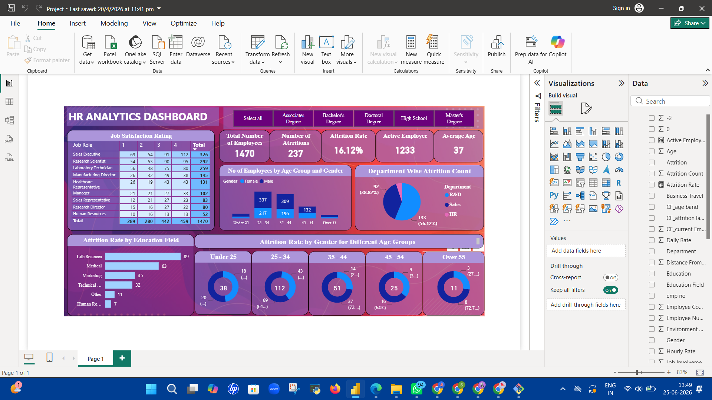
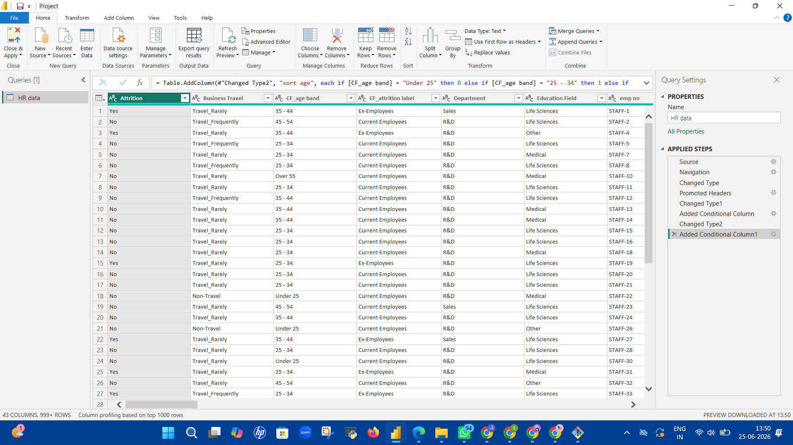

## 🚀HR Analytics Dashboard
---
### Prerequisites
- Microsoft Power BI Desktop (free) — [Download here](https://powerbi.microsoft.com/desktop/)
- Microsoft Excel (to view/edit the raw dataset)

### Steps to Run

1. **Clone or download** this repository.
2. Open `HR_Data.xlsx` to explore or modify the raw data.
3. Open `HR_Analytics_Dashboard.pbix` in Power BI Desktop.
4. If the data source path has changed, go to:  
   `Home → Transform Data → Data Source Settings`  
   and update the file path to point to your local `HR_Data.xlsx`.
5. Click **Refresh** to reload the data.
6. Use the education-level filter buttons at the top to slice the dashboard interactively.

---

## Dashboard Preview




## 🗂️ Dataset

**File:** `HR_Data.xlsx` | **Records:** 1,470 employees | **Attritions:** 237 | **Active:** 1,233

This dataset simulates a real-world HR scenario across three departments — **R&D, Sales, and HR**. Each row represents one employee and covers demographics, job details, compensation, satisfaction scores, and work-life factors — commonly used for attrition analysis and HR predictive modeling.

### Key Columns

| Column | Description |
|---|---|
| `Attrition` | Whether the employee left — `Yes` / `No` |
| `Department` | R&D, Sales, or HR |
| `Job Role` | 9 roles: Sales Executive, Research Scientist, Lab Technician, Manager, etc. |
| `Age` / `CF_age band` | Age in years + grouped bracket (Under 25 → Over 55) |
| `Education` | Level 1–5: High School to Doctoral Degree |
| `Education Field` | Life Sciences, Medical, Marketing, Technical, HR, Other |
| `Job Satisfaction` | Rating 1 (Low) → 4 (Very High) |
| `Monthly Income` | Employee monthly salary |
| `Over Time` | Overtime status: `Yes` / `No` |
| `Business Travel` | Non-Travel, Travel\_Rarely, Travel\_Frequently |
| `Years At Company` | Total tenure in years |
| `Work Life Balance` | Self-reported rating 1–4 |
| `Performance Rating` | Last appraisal score 1–4 |
| `Training Times Last Year` | No. of training sessions attended |
## 📊 Calculated Measures (DAX)

```dax
-- Attrition Rate
Attrition Rate =
    DIVIDE(
        COUNTROWS(FILTER('HR data', 'HR data'[Attrition] = "Yes")),
        COUNTROWS('HR data'),
        0
    )

-- Active Employees
Active Employees =
    COUNTROWS(FILTER('HR data', 'HR data'[Attrition] = "No"))

-- Average Age
Average Age = AVERAGE('HR data'[Age])
```

---

## 🤝 Contributing

Contributions are welcome! To suggest improvements or report issues:

1. Fork the repository.
2. Create a new branch (`git checkout -b feature/your-feature`).
3. Commit your changes (`git commit -m 'Add your feature'`).
4. Push to the branch and open a Pull Request.


## 👤 Author

Developed as part of an HR Analytics project to demonstrate business intelligence and workforce data visualization skills.

---

*Built with ❤️ using Power BI*
